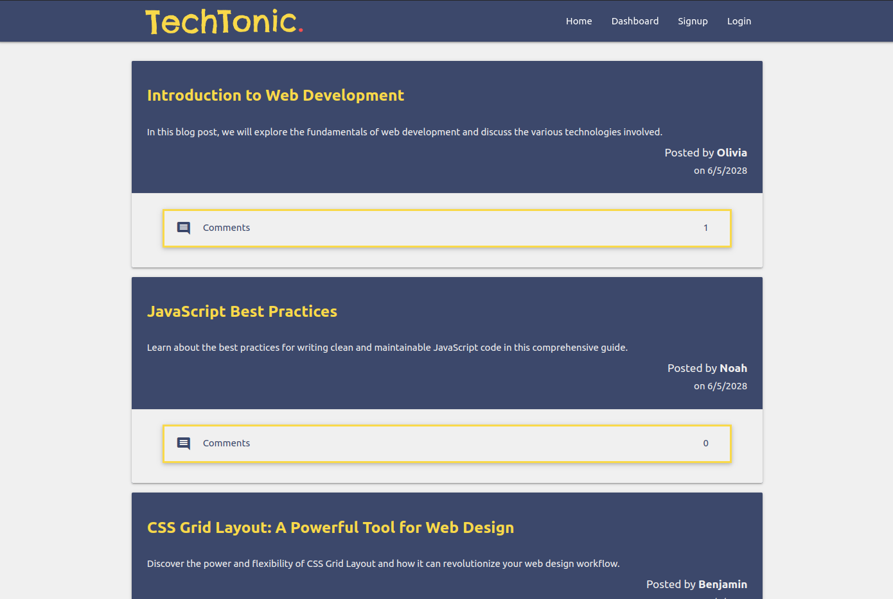
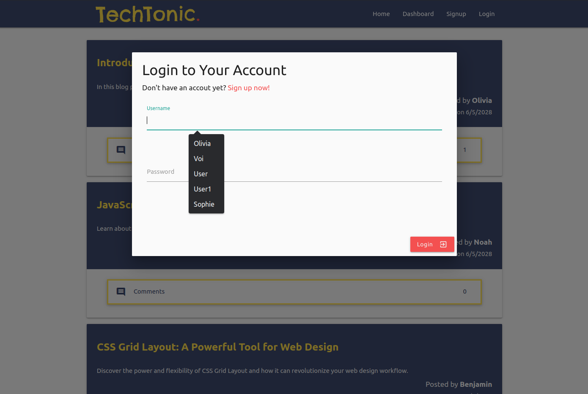
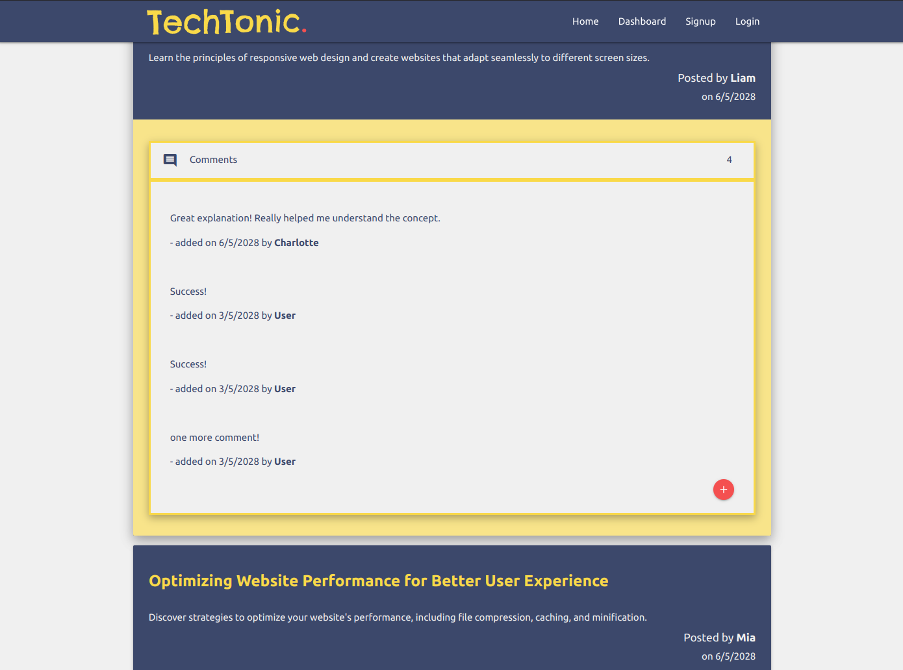
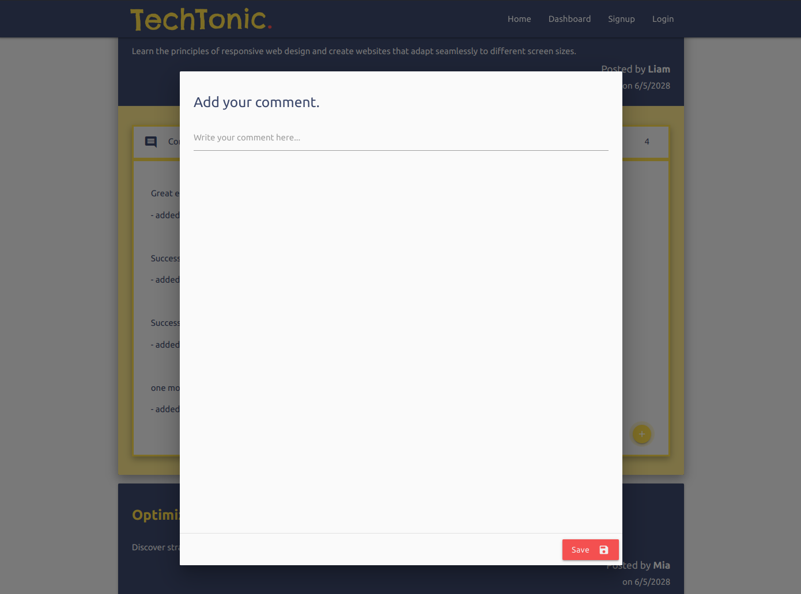
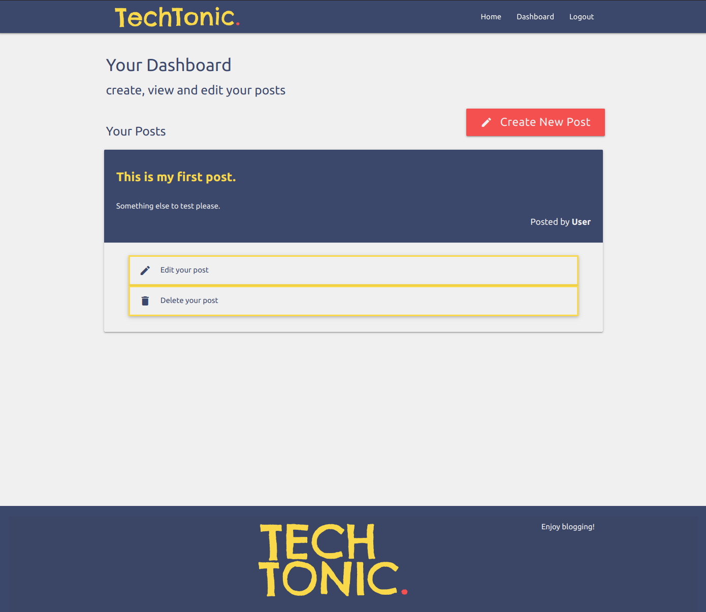
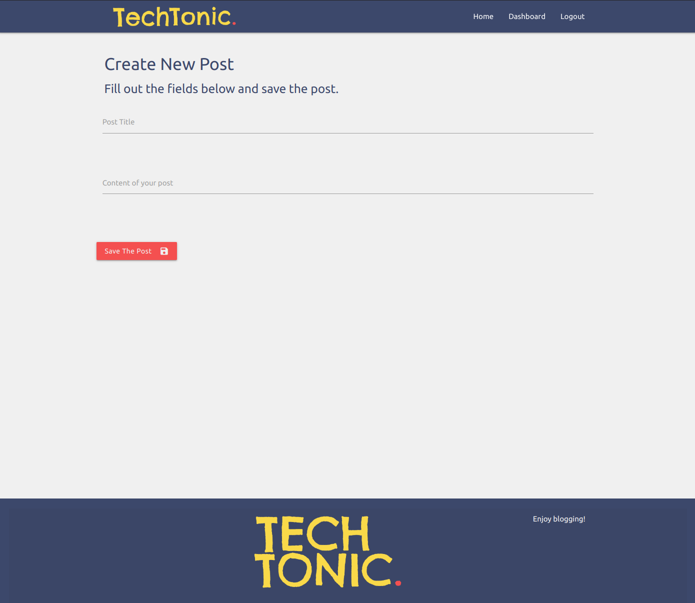

# TechTonic Blog

## Description

TechTonic is a new sleek and cool tech blog for you to share posts with other users and comment their posts.

## Table of Contents

- [Usage](#usage)
- [License](#license)
- [Contributing](#contributing)
- [Questions](#questions)
- [Credits](#credits)
- [Links](#links)

## Usage

### Homepage

When you visit the site for the first time, you will be presented with the homepage.
The homepage includes existing blog posts, if any have been posted.
You will find navigation links for the homepage and the dashboard.
You will also have the option to log in and sign up. Clicking on the Homepage option in the navigation will take you to the homepage.
Clicking on any other links in the navigation will prompt you to either sign up or sign in.

When you open the app you are presented with the landing page. Press **Get Started** button to proceed to the notes editor.

### Sign Up

If you choose to sign up, you will be prompted to create a username and password.
After entering your credentials, click on the sign-up button.
Your user credentials will be saved, and you will be logged into the site.

### Log In

If you have already signed up and revisit the site, choose the log-in option.
You will be prompted to enter your username and password.
After providing your credentials, you will be signed in to the site.

### Signed-In User Experience

When you are signed in to the site, you will see navigation links for the homepage, the dashboard, and the option to log out.
Clicking on the Homepage option in the navigation will take you to the homepage.
On the homepage, you will see existing blog posts with their titles, contents, authors, created date and the number of comments for each post.

Clicking on the Comments section of existing blog post will display the available comments for the post and their creators, and the date it was created.
You will have the option to leave a comment there if you click the red plus button.
Enter your comment and click on the submit button to save it.
The post will be updated to display the new comment.

### Dashboard

Clicking on the Dashboard option in the navigation will take you to the dashboard.
The dashboard will present you with any blog posts you have already created.
You will also have the option to add a new blog post.

Clicking on the button to add a new blog post will prompt you to enter a title and contents for your post.
After entering the required information, click on the button to create a new blog post.

The title and contents of your post will be saved, and you will be taken back to an updated dashboard displaying your new blog post.
In the dashboard, you can click on one of your existing posts to delete or update it.

### Log Out

To log out, click on the Logout option in the navigation.
You will be signed out of the site.

### Idle Timeout

If you remain idle on the site for more than 15 min, you will still be able to view posts and comments.
However, before you can add, update, or delete posts, you will be prompted to log in again for security purposes.

(<a href="#readme-top">back to top</a>)

## License

Distributed under the [MIT License](https://opensource.org/licenses/MIT). See LICENSE.txt for more information.

(<a href="#readme-top">back to top</a>)

## Contributing

If you have a suggestion that would make this better, please fork the repo and create a pull request. You can also simply open an issue with the tag "enhancement".
Don't forget to give the project a star!

1. Fork the Project
2. Create your Feature Branch (`git checkout -b feature/YourFeature`)
3. Commit your Changes (`git commit -m 'Add Your Feature'`)
4. Push to the Branch (`git push origin feature/YourFeature`)
5. Open a Pull Request

(<a href="#readme-top">back to top</a>)

## Questions

If you have any questions about the project please contact me through [my Github](https://github.com/voi-jankowski) or email me at [voi.jankowski@gmail.com](mailto:voi.jankowski@gmail.com).

(<a href="#readme-top">back to top</a>)

## Credits

The color palette was sourced from [ColorHunt](https://colorhunt.co/palette/3c486bf0f0f0f9d949f45050).

The UI was created with [Materialize CSS](https://materializecss.com/about.html).

(<a href="#readme-top">back to top</a>)

## LInks

The location of the project [on GitHub](https://github.com/voi-jankowski/tech-blog).

You can check out the live application [here](https://safe-sea-90944.herokuapp.com/).

(<a href="#readme-top">back to top</a>)

